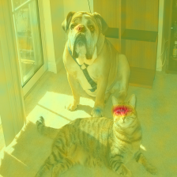
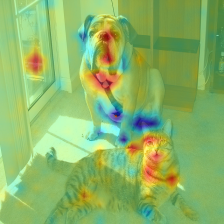

# Tensorflow Interpretable Explanations of Black Boxes by Meaningful Perturbation

I haven't found any Tensorflow code for the paper. So, I do it.

A library built to replicate the [Pytorch-explain-black-box](https://github.com/jacobgil/pytorch-explain-black-box) library built for the [Interpretable Explanations of Black Boxes by Meaningful Perturbation by Ruth at el](https://arxiv.org/abs/1704.03296), running entirely on Tensorflow Eager Execution.

All credits for the codebase go to [jacobgil](https://github.com/jacobgil) for providing an excellent base to reimplement from.

I slightly modified the code.
The loss function changed from the original
```
loss_fn=l1_coeff*tf.reduce_mean(tf.math.abs(1-mask))+outputs[0, category.numpy()[0]]*tv_coeff*total_grad
```
to
```
loss_fn=l1_coeff*tf.reduce_mean(tf.math.abs(1-mask))+tv_coeff*outputs[0, category.numpy()[0]]+total_grad
```
Moreover, I made l1_coeff and tv_coeff as trainable variables.
So, gradients will flow on the coefficients and mask as well.

# Basic Usage

If you execute the following code,
then the explanations of the image will be stored in the result folder.
```
explain(img_path)
```

# Experiment

When I experimented with the setting which is original setting
```
loss_fn=l1_coeff*tf.reduce_mean(tf.math.abs(1-mask))+outputs[0, category.numpy()[0]]*tv_coeff*(total_grad+0.01)

l1_coeff=0.01 # Non-trainable
tv_coeff=0.2 # Non-trainable
```
I got the following result;



It looks clean, but I found that it is unstable and dependent on the data, coefficients when I used another data like bicycle, flute.

So I tried to make coefficients trainable for stability and modified the loss function.
With modified settings (trainable coefficients and loss function),

I got the following result;



It doesn't look clean, but it is more stable, which means that it is not highly dependent on coefficients and image.

By modifying the loss function and some settings, you can enjoy.

# Reference
If you found this library useful in your research, please consider citing

```
@article{ruth2017ICCV,
  title={Interpretable explanations of black boxes by meaningful perturbation},
  author={Ruth C.Fong and Andrea Vedaldi},
  journal={Proceedings of the 2017 IEEE International Conference on Computer Vision (ICCV)},
  year={2017}
}
```
